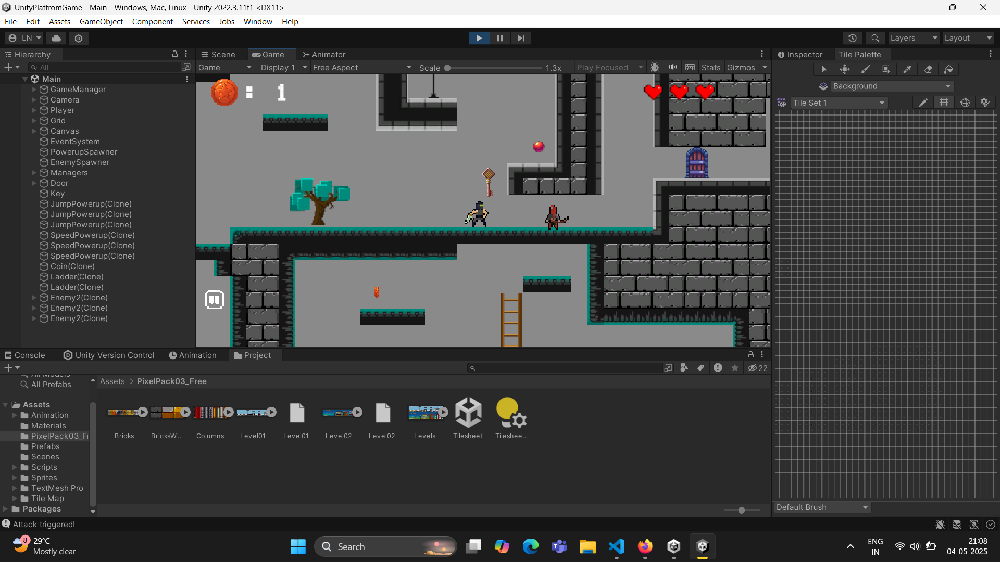
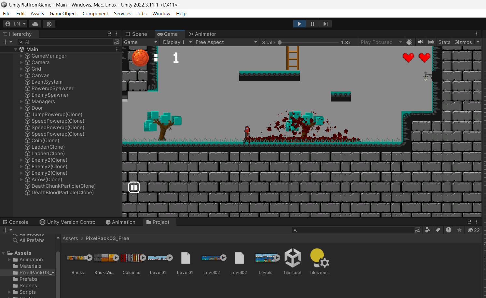
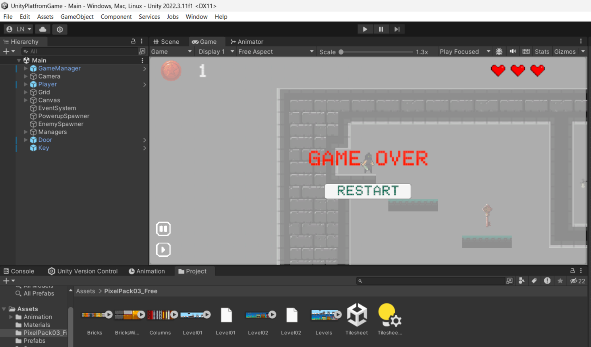

2D Platformer Game

A classic 2D platformer game developed using **Unity Game Engine** and **C#**, featuring smooth player movement, interactive enemies, collectibles, and level progression mechanics.

🎮 Features

- Player and enemy movement mechanics
- Power-ups to enhance gameplay
- Ladder climbing system
- Menu and Game Over screens
- Life system and coin counter
- Key and door mechanics for level progression

🛠 Tech Stack

- **Engine:** Unity
- **Language:** C#
- **Tools:** Unity Editor, Visual Studio

🚀 Getting Started

Prerequisites
- [Unity Hub](https://unity.com/download)
- Unity version (2022.3.11f1)
- Visual Studio or any C# compatible IDE

Installation

1. Clone the repository:
   git clone https://github.com/LeN3003/gp.git
2. Open Unity Hub and add the cloned project folder.
3. Open the project and press the Play button in the editor.
   
📸 Screenshots

